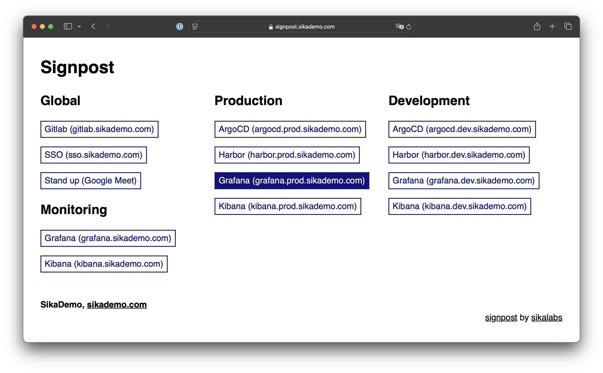

# signpost

**Signpost** is a tool that serves as a web hub where you can have all important links in one place. It allows you to centralize access to relevant resources, documents, or applications, making navigation easier and saving time.

Signpost is configrured using a single **YAML** file, designed to by simple, GitOps, and Kubernetes friendly.

## Examples

See [examples](./examples) for a few examples of how to configure signpost.
